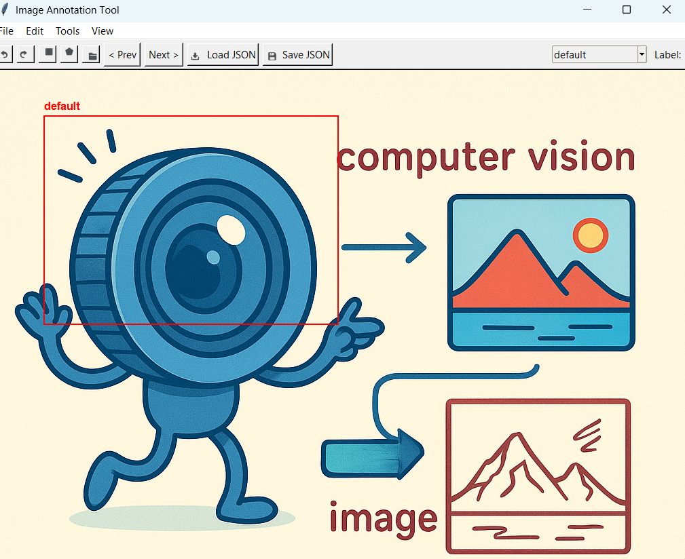

# 🖼️ Image Annotation Tool

A Tkinter-based desktop application for annotating images with bounding boxes and polygons. Perfect for preparing datasets for computer vision tasks.



## ⚙️ Features

* **Box & Polygon Annotation**: Draw axis-aligned bounding boxes or freeform polygons on images.
* **Labeling** : Assign labels to each annotation via dropdown; editable and customizable.
* **Undo/Redo**: Mistakes? Easily undo (Ctrl+Z) or redo (Ctrl+Y) actions.
* **Zoom & Pan**: Mouse wheel to zoom; middle-click drag to pan the image.
* **Multi-image Navigation**: Open a folder or single image, then use `< Prev` / `Next >` to cycle through.
* **Save & Load**: Export annotations to JSON or CSV; reload existing annotation files.
* **Color-coded Labels**: Each label gets a unique color for easy visualization.
* **Dark Mode**: Toggle between light and dark UI themes via `View → Dark Mode`.
* **Menu & Toolbar**: Intuitive menu bar with icons and keyboard shortcuts.

## 🛠️ Installation

1. **Clone the repository:**

   ```bash
   git clone https://github.com/Aysenur-Erkin/image_annotator_tk.git
   cd image_annotation_tool
   ```

2. **Create a virtual environment (optional but recommended):**

   ```bash
   python -m venv .venv
   source .venv/bin/activate   # Linux/Mac
   .\.venv\Scripts\activate  # Windows
   ```

3. **Install dependencies:**

   ```bash
   pip install -r requirements.txt
   ```

4. **Run the app:**

   ```bash
   python app.py
   ```

## 🚀 Usage

1. **Open images:** Click `File → Open` or use the 📂 icon / Ctrl+O to select a folder or single file.
2. **Select annotation mode:** Choose **Box** or **Poly** from the toolbar or via Tools menu (B/P keys).
3. **Draw annotations:**

   * **Box:** Click and drag.
   * **Polygon:** Click to place vertices, press Enter to finish, Esc to cancel.
4. **Assign labels:** Pick from the dropdown or type a new label and press Enter / click outside.
5. **Undo/Redo:** Use the ⬅️ / ➡️ icons or Ctrl+Z / Ctrl+Y.
6. **Zoom & Pan:** Scroll wheel to zoom, middle mouse to drag.
7. **Save & Load:** Use the 💾 Save JSON or 📥 Load JSON buttons (or File menu).

## ⌨️ Keyboard Shortcuts

| Shortcut | Action              |
| -------- | ------------------- |
| Ctrl + O | Open image/folder   |
| Ctrl + S | Save annotations    |
| Ctrl + L | Load annotations    |
| Ctrl + Z | Undo                |
| Ctrl + Y | Redo                |
| Ctrl + B | Select Box tool     |
| Ctrl + P | Select Polygon tool |

## 🎨 Customization

* **Add new labels** directly in the dropdown.
* **Icon & Theme**: Swap out PNGs in `resources/` or tweak colors in `main_window.py`.

## License

This project is released under the MIT License. See [LICENSE](LICENSE) for details.
